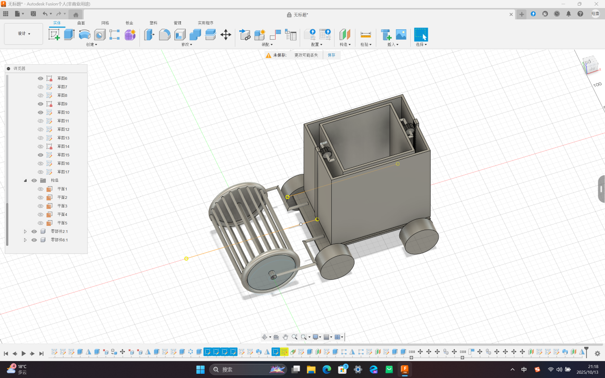
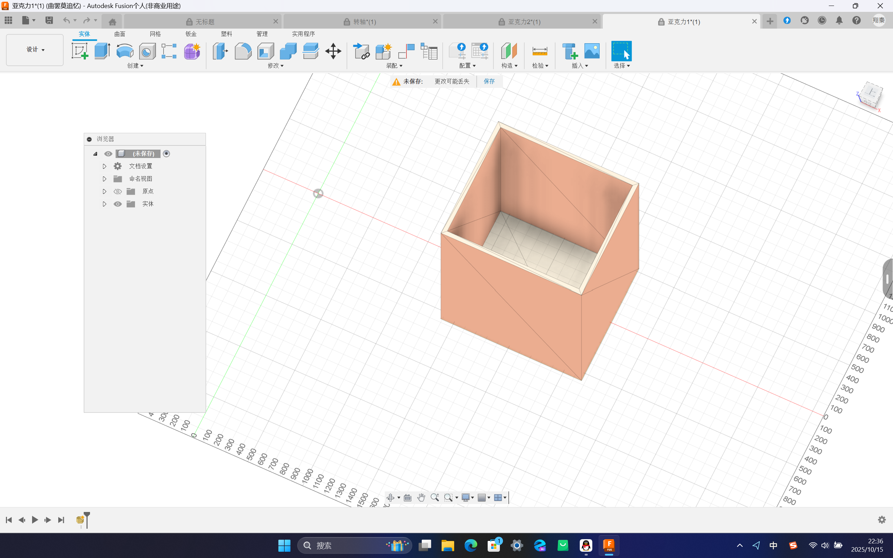
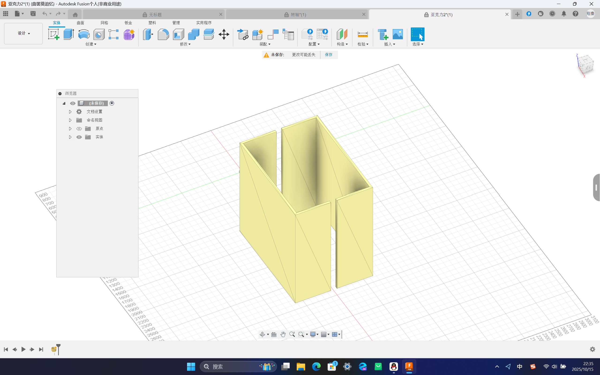
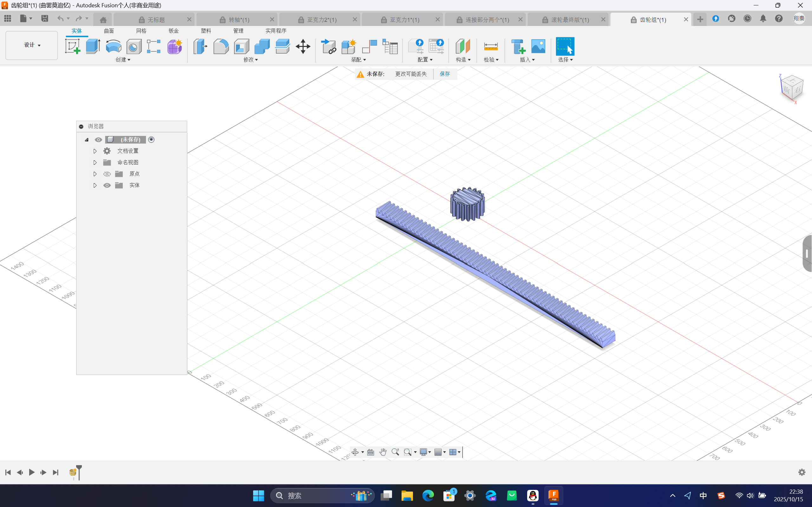
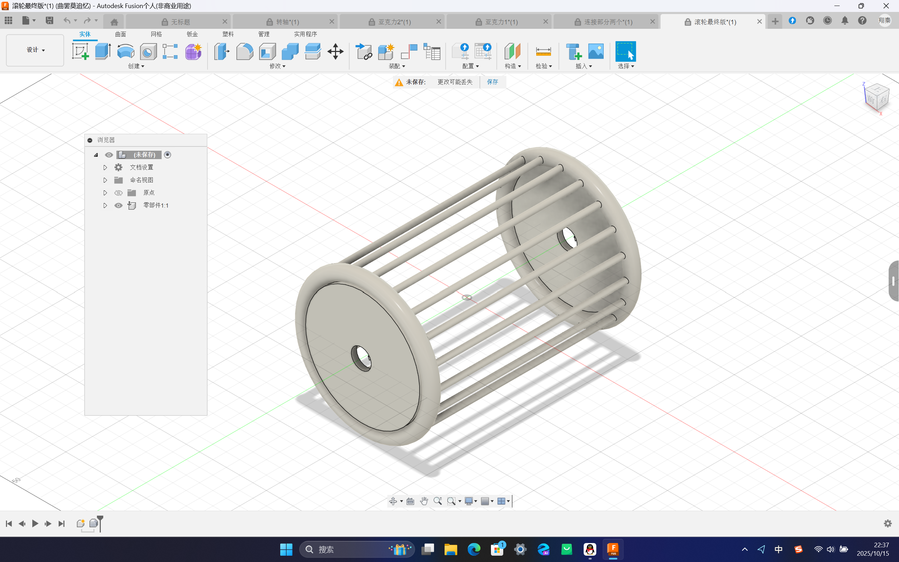
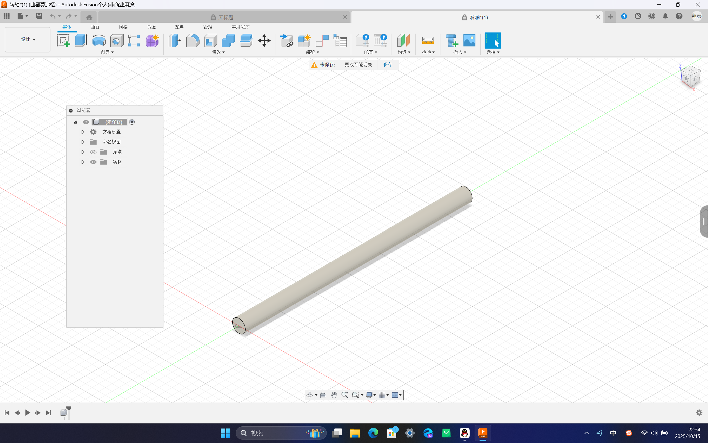

# 2025/10/13  开发日志

# [机械]一号机器人建模完成
完成了一号机器人的底盘、滚轮、转轴、齿轮、齿条、连接转轴与底板的连接件以及内外货箱的建模。整车外观如图：
  

以下介绍机器人建模的各个部件。

## 向上收集结构--内外货箱
**内货箱**为固定在小车底板上的由亚克力板构成的长方体货箱，用于储存小球。其外观如图：
  

  
**外货箱**为可上升的硬质长方体结构，由两个U型结构拼接而成。中间由齿条进行连接。用于上升接住从好好先生中掉出来的小球。其外观如图：
  

## 向上收集结构的运动--齿轮和齿条
**齿轮和齿条**用于实现外货箱的上升。总共有两对，位于外货箱接缝处。其外观如图：
  

## 前置收集器--滚轴和转轴
**滚轴**为小车前方的圆柱形笼状结构，其原理类似于网球收集器。其外观如图：
  

  
**转轴**为小车前方的转轴，用于转动滚轴。其外观如图：
  

