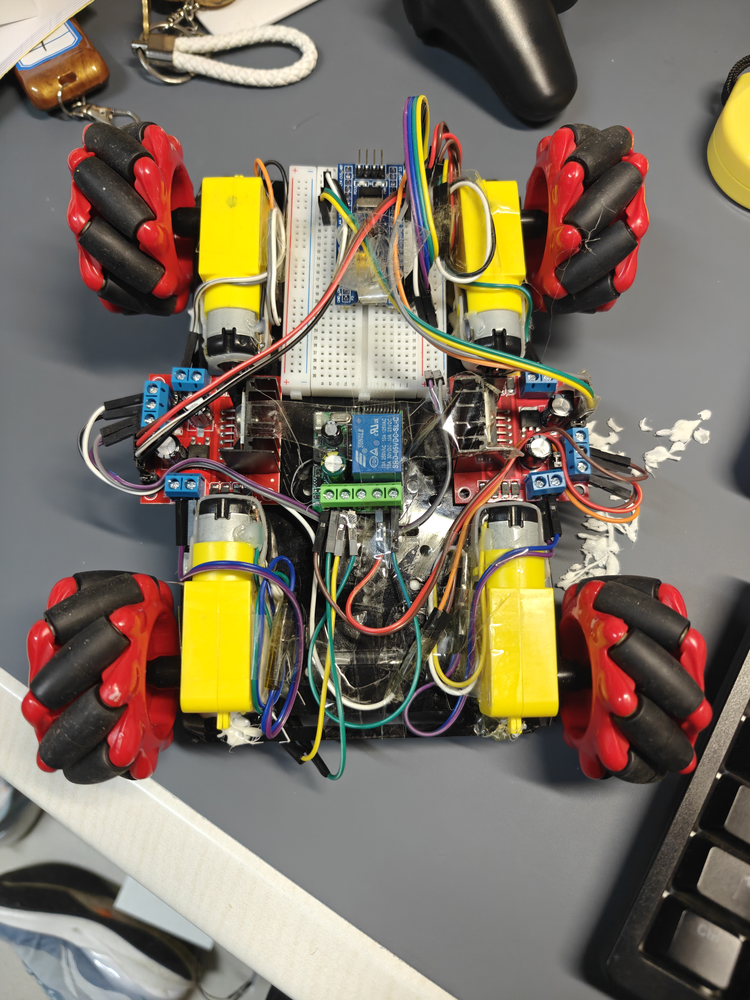
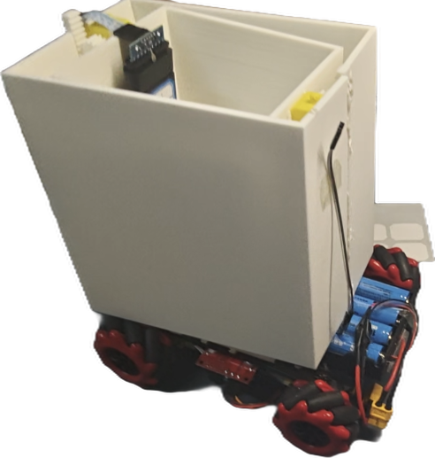

# 一号机器人技术文档

## 功能一：底盘运动
  
**功能描述**  
使机器人能够通过麦克纳姆轮实现基本的前后左右及转向运动。  

**开发历程**
1. [2025/10/23] **硬件搭建**  
该机器人采用TT马达+麦轮的方式实现机器人的底盘运动。
一块面包板、两块L298N、一块遥控继电器分布在底盘下，为顶部结构留出宝贵空间。
经过研究，我们决定使用AB胶+热熔胶的双胶配合方式连接电机和底板。
原因如下：AB胶的强度高但是凝固时间长；热熔胶的强度低但是凝固时间短。使用AB胶+热熔胶的结合方式，可以在AB胶未凝固之前，
保证电机在粘贴过程中不会位移，保证电机在运动过程中不会抖动。底盘搭建完成之后的外观如图所示：（此为底面）
  
  
  
2. [2025/10/25] **代码编写**  
   为了高效的实现对机器人的控制，同时降低代码的耦合度方便后期维护，我将负责控制的代码分成了Bsp、Macanum和Control三个部分。  
**电机控制**
首先，通过Bsp.h和Bsp.cpp中编写的用于控制电机的类实现了对电机的简易控制。
为什么要使用c++中类的概念呢？因为类中封装了电机的控制方法，这样在代码中调用的时候，
就不需要再写电机的控制代码，只需要调用类中的方法即可。以下是一些代码片段以介绍电机的控制：
```c++
//Bsp.h
enum class MotorType
{
    DC,
    Servo,
};

class Motor
{
public:
    Motor(TIM_HandleTypeDef* tim, uint32_t channel, MotorType type);

    void Init();  // 初始化
    void setSpeed(float duty);  //[0.0, 1.0]  控制直流电机
    void setAngle(float angle);  //[0.0, 180.0]  控制舵机

private:
    TIM_HandleTypeDef* m_tim;
    uint32_t m_channel;
    MotorType m_type;
};
```
这一段代码前面的枚举是为了利用舵机和马达初始化时的统一性减少重复的类定义。
创建电机对象时，需要传入TIM_HandleTypeDef* tim，uint32_t channel，MotorType type三个参数。
  
```c++
//Bsp.h
#ifdef __cplusplus

extern "C" {
#endif

    void BSP_Init();
    void Servo_setAngle(float angle);
    void LF_setSpeed(float duty);  // 左前电机，[-1, 1]
    void LB_setSpeed(float duty);  // 左后电机，[-1, 1]
    void RF_setSpeed(float duty);  // 右前电机，[-1, 1]
    void RB_setSpeed(float duty);  // 右后电机，[-1, 1]

#ifdef __cplusplus

}
#endif
```
这一段代码为C语言提供入口函数，使其他文件能够调用这些函数控制电机。
```c++
//Bsp.cpp
Motor::Motor(TIM_HandleTypeDef* tim, uint32_t channel, MotorType type)
    : m_tim(tim), m_channel(channel), m_type(type){}

/**
 * @brief 设置直流电机转速
 * @param duty 占空比值，范围0.0-1.0，0表示停止，1表示全速
 * 
 * 该函数通过PWM控制直流电机转速，仅对直流电机类型有效
 */
void Motor::setSpeed(float duty)
{
    // 检查电机类型，仅直流电机可设置转速
    if (m_type != MotorType::DC)
    {
        return;
    }
    
    // 限制占空比范围在0.0-1.0之间
    if (duty < 0.0f)
    {
        duty = 0.0f;
    }
    if (duty > 1.0f)
    {
        duty = 1.0f;
    }

    // 计算比较值并设置PWM占空比
    auto compare = static_cast<uint32_t>(m_tim->Init.Period * duty);
    __HAL_TIM_SET_COMPARE(m_tim, m_channel, compare);
}

/**
 * @brief 设置舵机角度
 * @param angle 舵机角度，范围0-180度
 * 
 * 该函数控制舵机转动到指定角度，仅对舵机类型有效
 */
void Motor::setAngle(float angle)
{
    // 检查电机类型，仅舵机可设置角度
    if (m_type != MotorType::Servo)
    {
        return;
    }
    
    // 限制角度范围在0-180度之间
    if (angle < 0.0f)
    {
        angle = 0.0f;
    }
    if (angle > 180.0f)
    {
        angle = 180.0f;
    }
    
    // 计算脉冲宽度并设置舵机角度
    auto pulse = static_cast<uint16_t>(angle / 180.0f);
    __HAL_TIM_SET_COMPARE(m_tim, m_channel, pulse);
}

/**
 * @brief 初始化电机PWM输出
 * 
 * 启动定时器PWM输出功能，并将比较值初始化为0
 */
void Motor::Init()
{
    HAL_TIM_PWM_Start(m_tim, m_channel);
    __HAL_TIM_SET_COMPARE(m_tim, m_channel, 0);
}
```
这一段代码为电机类中的成员函数，用于初始化及设置电机的转速和角度。  
```c++
//Bsp.cpp
extern "C"{
    static Motor DC1(&htim2, TIM_CHANNEL_1, MotorType::DC);
    static Motor DC2(&htim2, TIM_CHANNEL_2, MotorType::DC);
    static Motor DC3(&htim2, TIM_CHANNEL_3, MotorType::DC);
    static Motor DC4(&htim2, TIM_CHANNEL_4, MotorType::DC);
    static Motor DC5(&htim4, TIM_CHANNEL_1, MotorType::DC);
    static Motor DC6(&htim4, TIM_CHANNEL_2, MotorType::DC);
    static Motor DC7(&htim4, TIM_CHANNEL_3, MotorType::DC);
    static Motor DC8(&htim4, TIM_CHANNEL_4, MotorType::DC);

    void BSP_Init()
    {
        DC1.Init();
        DC2.Init();
        DC3.Init();
        DC4.Init();
        DC5.Init();
        DC6.Init();
        DC7.Init();
        DC8.Init();
    }
```
这段代码通过创建8个电机对象并初始化对象，使后续函数能够分别控制电机。

```c++
//Bsp.cpp
void LF_setSpeed(float duty) //DC1, DC2
    {
        if (duty < -1.0f)
        {
            duty = -1.0f;
        }
        if (duty > 1.0f)
        {
            duty = 1.0f;
        }

        if (duty < 0.0f)
        {
            DC2.setSpeed(0-duty);
            DC1.setSpeed(0);
        }
        else if (duty > 0.0f)
        {
            DC1.setSpeed(duty);
            DC2.setSpeed(0);
        }
        else
        {
            DC1.setSpeed(0);
            DC2.setSpeed(0);
        }
    }
```
这一段代码展示了控制左前轮的函数。duty为速度百分比，范围-1~1。左前轮的电机为DC1和DC2，因此根据速度百分比duty，
当duty>0时，将DC1的占空比设置为正数duty，将DC2的占空比设置为0。当duty<0时，将DC1的占空比设置为0，将DC2的占空比设置为正数0-duty。
通过这个函数，我们能轻松的控制一个电机的转动。另外3个电机控制函数的代码与这个相近，在此省略。
  
**麦轮解算**  
这一部分主要介绍如何实现麦轮解算，主要由Macanum.h和Macanum.c两个文件组成。
为什么这一部分不再使用类的概念呢？因为这个解算算法是固定的，不需要再创建对象，只需要调用函数即可。
首先，我们需要定义一个浮点数列表来保存解算结果：
```c++
//Macanum.h
extern float MotorSpeed[4]; //各轮子数据 {LF, LB, RF, RB}
```
这一行代码定义了一个名为MotorSpeed的全局变量，用于保存解算后的电机数据。 
接下来，我们需要定义一个函数来执行解算：
```c++
//Macanum.h
void MecanumCalculate(float Vx, float Vy, float omega);
```
这一行代码定义了一个名为MecanumCalculate的函数，接收三个参数Vx、Vy和omega，分别表示机器人的X轴、Y轴和角速度。
函数的实现如下
```c++
//Macanum.c
void MecanumCalculate(float Vx, float Vy, float omega)
{
    float LENGTH = 0.6f;
    float WIDTH = 0.4f;
    float RADIUS = 1.0f;

    float R = LENGTH + WIDTH;

    MotorSpeed[0] = (Vx + Vy - omega * R) / RADIUS;
    MotorSpeed[1] = (Vx - Vy - omega * R) / RADIUS;
    MotorSpeed[2] = -(Vx + Vy + omega * R) / RADIUS;
    MotorSpeed[3] = -(Vx - Vy + omega * R) / RADIUS;
}
```
其中LENGTH、WIDTH和RADIUS分别表示机器人的长度、宽度和半径。这需要依据实车进行调整。

**实现控制**
为了实现对控制的管理，我创建了Control.h和Control.c两个文件,并将主要的控制方式写在里面。
```c++
//Control.h
void Control(); // 主控制函数，将其他函数放入其中调用
void Movement(); // 移动
```
这段代码定义了一个名为Control的函数，用于管理控制流程。另一个函数Movement()则是控制移动任务的函数
函数Movement()的实现如下：
```c++
//Control.c
void Movement()
{
    MecanumCalculate(Joystick[0]/100, Joystick[1]/100, Joystick[3]/100);

    LF_setSpeed(MotorSpeed[0]);
    LB_setSpeed(MotorSpeed[1]);
    RF_setSpeed(MotorSpeed[2]);
    RB_setSpeed(MotorSpeed[3]);
}
```
这一段代码首先调用MecanumCalculate()函数，传入Joystick数组（储存ps2中经过处理的摇杆数据）中的数据，并得到解算后的电机数据。
然后，将解算后的电机数据传入对应的电机函数中，完成电机的转动。就这样，我们实现了最基础的底盘运动。

## 功能二：PS2控制

**功能描述**  
实现对PS2手柄的读取以及使用PS2手柄对机器人进行控制。

**开发历程**

[2025/10/18] **代码编写**
为了实现双灯版本的PS2手柄控制，我使用了来自CRTC赛事群中提供的ax_ps2.h和ax_ps2.c文件，
并在此基础上编写了PS2.h和PS2.c文件用于简化PS2使用方法。  
以下是代码讲解。  
首先，我们需要定义一个全局变量来保存PS2数据：
```c++
//PS2.h
extern float Joystick[4]; //摇杆数据 [L_UD,L_LR,R_UD,R_LR] range:[-100, 100]
```
这一行代码定义了一个名为Joystick的全局变量，用于保存PS2的摇杆数据，方便其他文件调用  
在初始化ps2前，我们需要一个结构体来保存PS2数据：
```c++
//PS2.h
JOYSTICK_TypeDef ps2;
 ```
接下来，我们需要函数完成PS2的初始化：
```c++
//PS2.h
void PS2_Init()

//PS2.c
void PS2_Init()
{
    AX_PS2_Init();
}
 ```
这一段代码调用了AX_PS2_Init()函数，完成PS2的初始化。  
初始化之后，我们可以封装一个函数来不断获取PS2数据：
```c++
//PS2.h
/*扫描PS2按键
 传入参数：
  *JoystickStruct = &ps2
 */
void PS2_ScanKey(JOYSTICK_TypeDef *JoystickStruct);

//PS2.c
void PS2_ScanKey(JOYSTICK_TypeDef *JoystickStruct)
{
    AX_PS2_ScanKey(JoystickStruct);
    HAL_Delay(10);
}
 ```
这一段代码调用AX_PS2_ScanKey()函数，将PS2数据保存在JoystickStruct中。并且添加了HAL_Delay(10)，以等待PS2数据稳定。  
随后，我们需要一个函数来处理PS2的按钮数据：
```c++
//PS2.h
/*判断按键是否按下
 传入参数：
    key：按键编号
     * 1 -> 上        * 9 -> L2
     * 2 -> 左        * 10 -> R2
     * 3 -> 下        * 11 -> L1
     * 4 -> 右        * 12 -> R1
     * 5 -> 三角形     * 13 -> 左摇杆按钮
     * 6 -> 圆形       * 14 -> 右摇杆按钮
     * 7 -> x         * 15 -> SELECT
     * 8 -> 矩形       * 16 -> START

    ps2:ps2

  返回值：
    1:按下   0:未按下
 */
uint8_t isKey(uint8_t key, JOYSTICK_TypeDef ps2);

//PS2.c
uint8_t isKey(uint8_t key, JOYSTICK_TypeDef ps2)
{
    uint8_t pressedBtn;
    switch (ps2.btn1)
    {
    case 1:  pressedBtn = 15;  break;
    case 2:  pressedBtn = 13;  break;
    case 4:  pressedBtn = 14;  break;
    case 8:  pressedBtn = 16;  break;
    case 16: pressedBtn = 1;   break;
    case 32: pressedBtn = 2;   break;
    case 64: pressedBtn = 3;   break;
    case 128:pressedBtn = 4;   break;
    default: pressedBtn = 0;   break;
    }
    switch (ps2.btn2)
    {
    case 1:  pressedBtn = 9;  break;
    case 2:  pressedBtn = 10;  break;
    case 4:  pressedBtn = 11;  break;
    case 8:  pressedBtn = 12;  break;
    case 16: pressedBtn = 5;   break;
    case 32: pressedBtn = 6;   break;
    case 64: pressedBtn = 7;   break;
    case 128:pressedBtn = 8;   break;
    default: pressedBtn = 0;   break;
    }
    if (pressedBtn == key)
    {
        return 1;
    }
    return 0;
}
```
这一段代码定义了一个函数isKey()，用于判断PS2的按键是否按下。函数接收两个参数：key和ps2。key是按键编号，ps2是PS2数据结构体。函数返回0或1，表示按键是否按下。
函数的实现原理是，将PS2的按键数据转换成对应的按键编号，并判断是否与传入的按键编号相同。
编写这个函数有利于便捷地实现对按钮的判断，方便控制任务的编写。调用这个函数的示例如下：
```c++
//实现按键摁下，小灯亮起；按键松开，小灯熄灭。
if (isKey(5, ps2))
{
   HAL_GPIO_WritePin(GPIOC, GPIO_PIN_13, GPIO_PIN_RESET);
}
else
{
   HAL_GPIO_WritePin(GPIOC, GPIO_PIN_13, GPIO_PIN_SET);
}
```
最后是处理摇杆数据的函数：
```c++
//PS2.c
void getJoystick(JOYSTICK_TypeDef ps2)
{
    if (ps2.mode == 65)  // 判断PS2是否为红灯模式，如果是，所有摇杆数据皆为0
    {
        for (int i=0; i < 4; i++)
            {
            Joystick[i] = 0;
            }
        return;
   uint8_t dataJoystick[4] = {ps2.LJoy_UD, ps2.LJoy_LR, ps2.RJoy_UD, ps2.RJoy_LR};
    for (int i=0; i < 4; i++)  //处理摇杆数据
    {
        if (dataJoystick[i] < 124)
        {
            Joystick[i] = ((128-dataJoystick[i])*100)/128;
        }
        else if (dataJoystick[i] > 134)
        {
            Joystick[i] = ((dataJoystick[i]-127)*100*-1)/128;
        }
        else
        {
            Joystick[i] = 0;
        }
    }
}
```
这一段代码定义了一个函数getJoystick()，用于处理PS2的摇杆数据。函数接收一个参数ps2，表示PS2数据结构体。
在红灯模式时，所有摇杆数据皆为0，防止意想不到的电机转动。
在处理摇杆数据时，我设置了一定的死区，防止摇杆回中不到位导致的意外控制。
通过一定的运算将摇杆数据转化到-100~100之间，方便后续的电机控制。

至此，ps2的函数编写已完成

## 功能三：可上升收集货舱

**功能描述**  
通过可上升的货舱，机器人有能力直接接收从“好好先生”掉落的小球。上升货舱能保证小球尽可能地落入货舱，这使机器人的收集能力得到提升。

**开发历程**

[2025/10/14] **3D模型绘制**
货舱由两部分组成：内货舱和外货舱。其中内货舱固定在底板上，负责储存小球。外货舱由两个TT马达驱动，通过齿轮与齿条的方式连接，并实现对外货舱升降的控制。
外货箱是分成两半打印的，这样做的目的是方便灵活地进行粘合。
货舱的3D模型绘制如下：  
内货舱

外货舱及齿条齿轮


[2025/10/25] **硬件搭建**
通过使用热熔胶，我们初步完成了货舱的搭建。
安装完货舱的小车如图所示：

